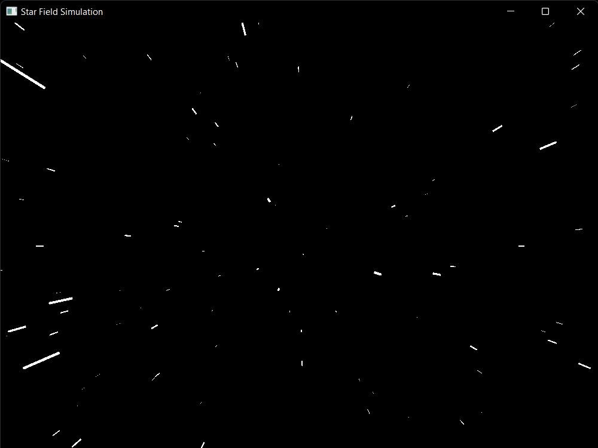

# Star Field Projection

    A star field projection in rust lang using piston-2d engine.

## How to Use

1. Clone this repo `git clone https://github.com/Redloaded24/star_field_simulation.git`
1. Run this project `cargo run --release` (for max performance)
1. Moving cursor up will accelerate your Space Ship
1. Moving cursor down will decelerate your Space Ship

## Source  

This is a rust version of [Star Field Projection](https://www.youtube.com/watch?v=17WoOqgXsRM)
  